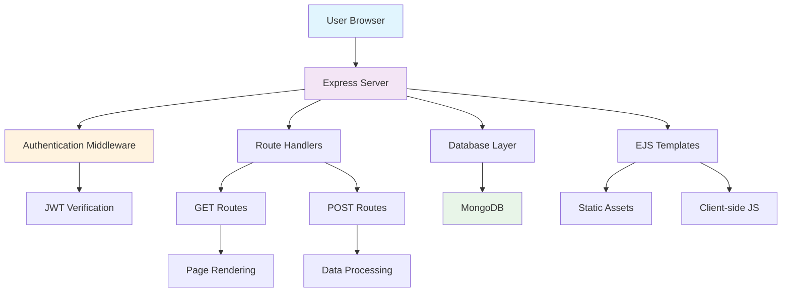
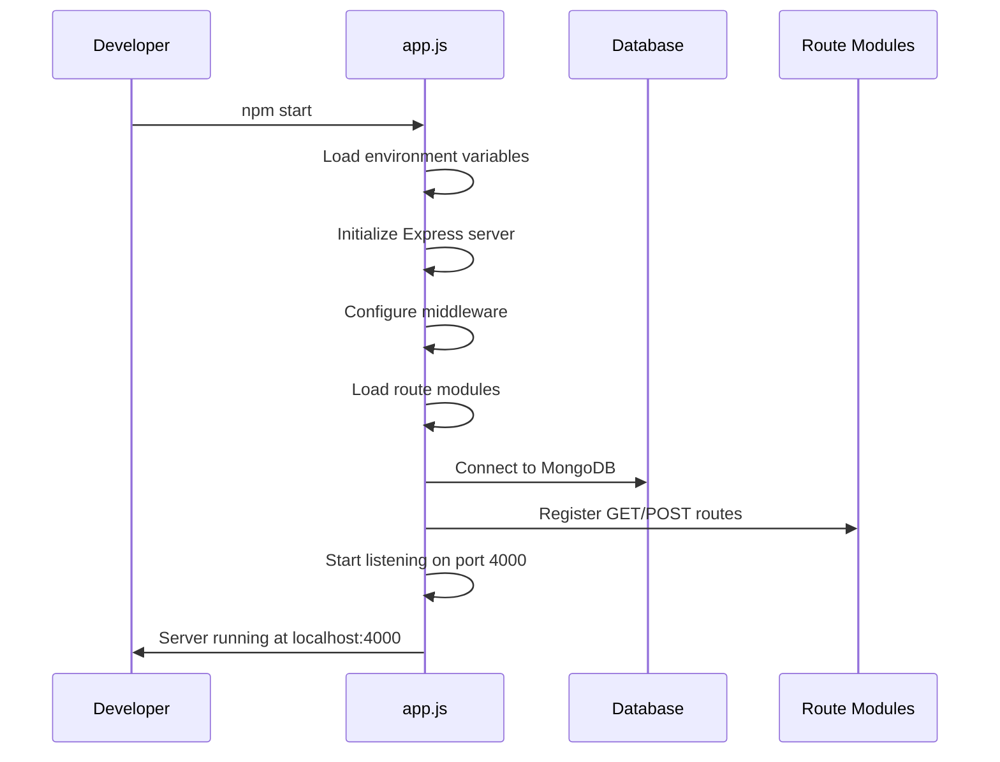
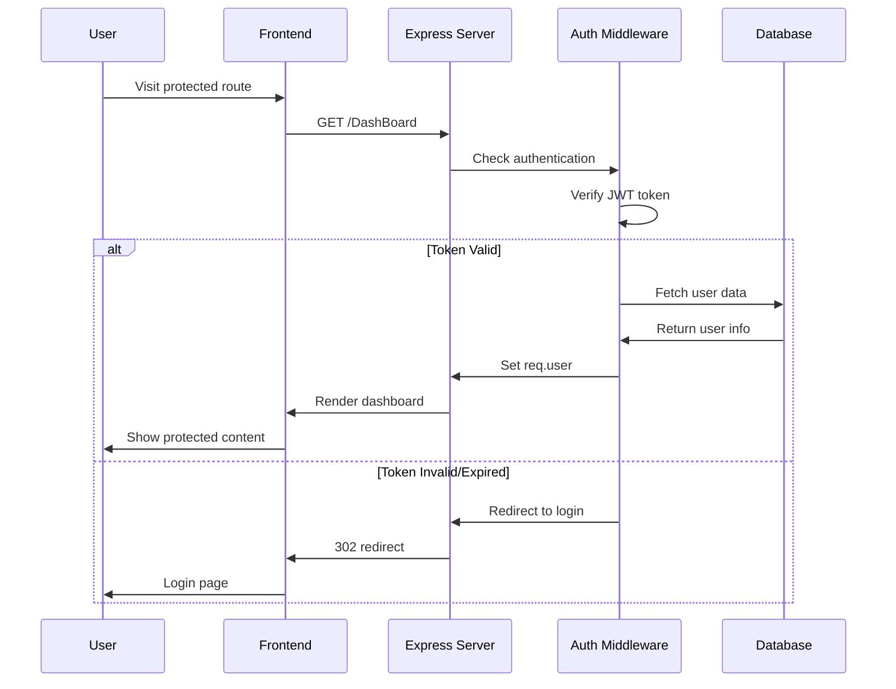
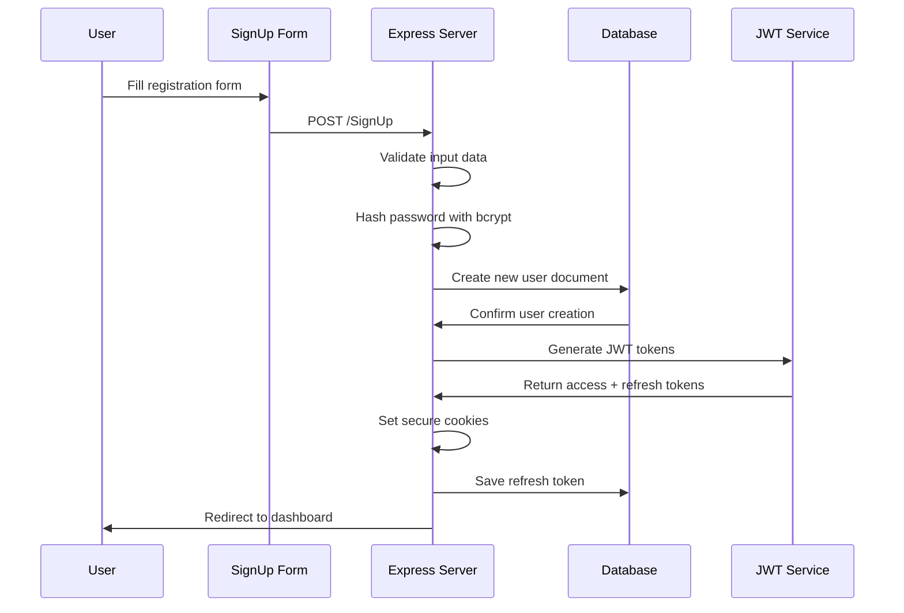

#  LifeLink - Blood Donation Management System

## 📋 Table of Contents
- [ Project Overview](#-project-overview)
- [ Architecture Overview](#️-architecture-overview)
- [ Repository Structure](#-repository-structure)
- [ Complete System Flow](#-complete-system-flow)
- [ Development Guide](#-development-guide)
- [ API Documentation](#-api-documentation)
- [ Frontend Guide](#-frontend-guide)
- [ Database Guide](#️-database-guide)
- [ Security Implementation](#-security-implementation)
- [ Deployment Guide](#-deployment-guide)
- [ Troubleshooting](#-troubleshooting)

---

## 🚀 Project Overview

**LifeLink** is a comprehensive blood donation management system designed to connect blood donors with recipients in emergency situations. The system facilitates donor registration, blood request management, and real-time coordination between healthcare facilities and donors.

### 🎯 **Key Features**
- **User Management**: Donor registration and authentication
- **Blood Request System**: Emergency blood requests and responses
- **Real-time Updates**: Live polling and notifications
- **Location-based Matching**: Geographic donor-recipient matching
- **Role-based Access**: Different permissions for users and donors

### 🛠️ **Technology Stack**
```
Frontend:    EJS Templates + Vanilla JavaScript + CSS
Backend:     Node.js + Express.js
Database:    MongoDB + Mongoose
Auth:        JWT + bcrypt
Real-time:   Socket.io
Email:       Nodemailer
```

---

## 🏗️ Architecture Overview

```
┌─────────────────┐    ┌─────────────────┐    ┌─────────────────┐
│   User Browser  │───▶│ Express Server  │───▶│   MongoDB DB    │
└─────────────────┘    └─────────────────┘    └─────────────────┘
         │                       │                       │
         │                       ▼                       │
         │              ┌─────────────────┐              │
         │              │ Auth Middleware │              │
         │              └─────────────────┘              │
         │                       │                       │
         │                       ▼                       │
         │              ┌─────────────────┐              │
         │              │ Route Handlers  │              │
         │              └─────────────────┘              │
         │                       │                       │
         │                       ▼                       │
         │              ┌─────────────────┐              │
         │              │ EJS Templates   │              │
         │              └─────────────────┘              │
         │                       │                       │
         ▼                       ▼                       ▼
┌─────────────────┐    ┌─────────────────┐    ┌─────────────────┐
│ Static Assets   │    │ Server Response │    │ Data Storage    │
│ (CSS, JS, Img) │    │ (HTML + Data)   │    │ (Users, Req)    │
└─────────────────┘    └─────────────────┘    └─────────────────┘
```


## 🏗️ Architecture Diagram



### **Request Flow Pattern**
```
1. Client Request → 2. Express Router → 3. Middleware → 4. Route Handler → 5. Database → 6. Response
```

---

## 📁 Repository Structure

```
LifeLink/
├── 📄 app.js                          # 🚀 Main server entry point
├── 📄 package.json                    # 📦 Dependencies and scripts
├── 📄 .env                           # 🔐 Environment variables
├── 📄 README.md                      # 📖 Project documentation
│
├── 📁 src/                           # 🎯 Source code directory
│   ├── 📁 models/                    # 🗄️ Database schemas
│   │   ├── 📄 user.js               # 👤 User/Donor model
│   │   ├── 📄 request.js            # 🩸 Blood request model
│   │   ├── 📄 response.js            # ✅ Response model
│   │   ├── 📄 register.js            # 📝 Registration model
│   │   └── 📄 bloodBanks.js         # 🏥 Blood bank model
│   │
│   ├── 📁 Routes/                    # 🛣️ API endpoints
│   │   ├── 📄 getRoutes.js          # 📥 GET request handlers
│   │   └── 📄 postRoutes.js         # 📤 POST request handlers
│   │
│   ├── 📁 middlewares/               # 🔒 Authentication & validation
│   │   └── 📄 auth.js               # 🔐 JWT verification middleware
│   │
│   ├── 📁 services/                  # 🚀 Business logic services
│   │   ├── 📄 mailer.js             # 📧 Email service
│   │   └── 📄 mapService.js         # 🗺️ Location services
│   │
│   ├── 📁 views/                     # 🎨 EJS templates
│   │   ├── 📁 pages/                 # 📄 Main page templates
│   │   │   ├── 📄 LOGIN.ejs         # 🔑 Login page
│   │   │   ├── 📄 SignUp.ejs        # ✍️ Registration page
│   │   │   ├── 📄 DashBoard.ejs     # 🏠 Main dashboard
│   │   │   └── 📄 donate.ejs        # 🩸 Donation page
│   │   │
│   │   └── 📁 partials/             # 🧩 Reusable components
│   │       ├── 📄 nav.ejs           # 🧭 Navigation bar
│   │       ├── 📄 emergencyForm.ejs # 🚨 Emergency form
│   │       └── 📄 profile.ejs       # 👤 User profile
│   │
│   ├── 📁 utils/                     # 🛠️ Utility functions
│   │   └── 📄 path.js               # 📁 Path utilities
│   │
│   └── 📄 db.js                     # 🗄️ Database connection
│
├── 📁 public/                        # 🌐 Static assets
│   ├── 📁 css/                       # 🎨 Stylesheets
│   │   ├── 📄 style.css             # 🎯 Main styles
│   │   ├── 📄 nav.css               # 🧭 Navigation styles
│   │   ├── 📄 userSignUp.css        # ✍️ Registration styles
│   │   └── 📄 respond.css           # ✅ Response styles
│   │
│   ├── 📁 js/                        # ⚡ Client-side JavaScript
│   │   ├── 📄 main.js               # 🎯 Main application logic
│   │   ├── 📄 login.js              # 🔑 Login functionality
│   │   ├── 📄 SignUp.js             # ✍️ Registration logic
│   │   ├── 📄 donate.js             # 🩸 Donation handling
│   │   ├── 📄 emergencyForm.js      # 🚨 Emergency form logic
│   │   └── 📄 polling.js            # 🔄 Real-time updates
│   │
│   └── 📁 Assets/                    # 🖼️ Images and media
│       ├── 📄 logo.jpg              # 🏷️ Company logo
│       ├── 📄 LL.jpg                # 🩸 LifeLink branding
│       └── 📄 Mesh.jpg              # 🎨 Background mesh
│
└── 📁 config/                        # ⚙️ Configuration files
    └── 📄 database.js               # 🗄️ Database config
```

---

## 🔄 Complete System Flow

### **1. 🚀 Application Startup Flow**

```
Developer runs npm start
         ↓
app.js loads and initializes
         ↓
Environment variables loaded (.env)
         ↓
Express server created
         ↓
Middleware configured (JSON, URL-encoded, cookies, static files)
         ↓
Route modules imported (getRoutes, postRoutes)
         ↓
Database connection established (MongoDB)
         ↓
Server starts listening on port 4000
         ↓
Ready to handle requests
```





**Key Files Involved:**
- **`app.js`** (Lines 1-34): Main server configuration
- **`src/db.js`**: Database connection
- **`src/Routes/getRoutes.js`**: GET route handlers
- **`src/Routes/postRoutes.js`**: POST route handlers

### **2. 🔐 User Authentication Flow**

```
User visits protected route (e.g., /DashBoard)
         ↓
Express router receives request
         ↓
auth middleware checks cookies for JWT token
         ↓
If token exists and valid:
  - Decode JWT payload
  - Fetch user from database
  - Set req.user for route handler
  - Continue to route
         ↓
If token invalid/expired:
  - Try refresh token
  - Generate new access token
  - Set new cookie
  - Continue to route
         ↓
If no valid tokens:
  - Redirect to /login
```




**Key Files Involved:**
- **`src/middlewares/auth.js`**: JWT verification logic
- **`src/models/user.js`**: User data model
- **`src/Routes/getRoutes.js`**: Protected route handlers

### **3. ✍️ User Registration Flow**

```
User fills registration form
         ↓
Form data sent to POST /SignUp
         ↓
Server validates input data
         ↓
Password hashed using bcrypt (salt: 10)
         ↓
New user document created in MongoDB
         ↓
JWT access token generated (7 days)
         ↓
JWT refresh token generated (30 days)
         ↓
Tokens set as secure HTTP-only cookies
         ↓
Refresh token saved to user document
         ↓
User redirected to /DashBoard
```

**Key Files Involved:**
- **`src/Routes/postRoutes.js`** (Lines 35-95): Registration handler
- **`src/models/user.js`**: User schema
- **`src/middlewares/auth.js`**: JWT generation

### **4. 🏠 Dashboard Access Flow**

```
Authenticated user visits /DashBoard
         ↓
auth middleware verifies user
         ↓
Route handler extracts user email from req.user
         ↓
Database query: find user by email
         ↓
User data retrieved and formatted
         ↓
EJS template rendered with:
  - User information
  - Specific JavaScript files (emergencyForm, polling)
         ↓
HTML response sent to browser
         ↓
Dashboard displayed with user data
```

**Key Files Involved:**
- **`src/Routes/getRoutes.js`** (Lines 25-50): Dashboard route
- **`src/views/pages/DashBoard.ejs`**: Dashboard template
- **`public/js/emergencyForm.js`**: Emergency form logic
- **`public/js/polling.js`**: Real-time updates

---

## 🔧 Development Guide

### **🆕 Adding New Features**

#### **1. Create New Route**
```javascript
// In src/Routes/getRoutes.js or postRoutes.js
getRouter.get("/new-feature", auth, async (req, res) => {
  try {
    // Your logic here
    res.render("pages/newFeature.ejs", { data: result });
  } catch (error) {
    res.status(500).send("Error occurred");
  }
});
```

#### **2. Create New Model**
```javascript
// In src/models/newModel.js
const mongoose = require('mongoose');

const newModelSchema = new mongoose.Schema({
  field1: String,
  field2: Number,
  createdAt: { type: Date, default: Date.now }
});

module.exports = mongoose.model('NewModel', newModelSchema);
```

#### **3. Create New View**
```html
<!-- In src/views/pages/newFeature.ejs -->
<%- include('../partials/nav') %>

<div class="container">
  <h1>New Feature</h1>
  <!--  HTML content -->
</div>

<script src="/js/newFeature.js"></script>
```

#### **4. Create New JavaScript File**
```javascript
// In public/js/newFeature.js
document.addEventListener('DOMContentLoaded', function() {
  // Your client-side logic
  console.log('New feature loaded!');
});
```

#### **Modifying Authentication**
```javascript
// In src/middlewares/auth.js
const auth = async function (req, res, next) {
  // Add your custom logic here
  // Example: Role-based access control
  if (req.user.role !== 'admin') {
    return res.status(403).send('Access denied');
  }
  next();
};
```

---


### **3. ✍️ User Registration Flow**


## 📚 API Documentation

### **🔐 Authentication Endpoints**

| Method | Endpoint | Description | Auth Required |
|--------|----------|-------------|---------------|
| `POST` | `/SignUp` | User registration | ❌ No |
| `POST` | `/login` | User authentication | ❌ No |
| `POST` | `/logout` | User logout | ✅ Yes |

### **📄 Page Rendering Endpoints**

| Method | Endpoint | Description | Auth Required | Template |
|--------|----------|-------------|---------------|----------|
| `GET` | `/Login` | Login page | ❌ No | `LOGIN.ejs` |
| `GET` | `/SignUp` | Registration page | ❌ No | `SignUp.ejs` |
| `GET` | `/DashBoard` | Main dashboard | ✅ Yes | `DashBoard.ejs` |
| `GET` | `/donate` | Donation page | ✅ Yes | `donate.ejs` |
| `GET` | `/profile` | User profile | ✅ Yes | `profile.ejs` |

###   Blood Management Endpoints

| Method | Endpoint | Description | Auth Required |
|--------|----------|-------------|---------------|
| `POST` | `/emergency-request` | Create blood request | ✅ Yes |
| `POST` | `/respond-to-request` | Respond to request | ✅ Yes |
| `GET` | `/api/requestData` | Get all requests | ❌ No |

---

## 🎨 Frontend Guide

### **📁 Structure**

```
src/views/
├── 📄 pages/           # Main page templates
│   ├── 📄 LOGIN.ejs    # Login form
│   ├── 📄 SignUp.ejs   # Registration form
│   ├── 📄 DashBoard.ejs # Main dashboard
│   └── 📄 donate.ejs   # Donation form
│
└── 📄 partials/        # Reusable components
    ├── 📄 nav.ejs      # Navigation bar
    ├── 📄 profile.ejs  # User profile section
    └── 📄 emergencyForm.ejs # Emergency form
```

### **🔧 Adding New Pages**

1. **Create EJS Template**
```html
<!-- src/views/pages/newPage.ejs -->
<%- include('../partials/nav') %>

<div class="container">
  <h1><%= pageTitle %></h1>
  <div class="content">
    <!-- Your content here -->
  </div>
</div>

<!-- Include specific JavaScript files -->
<% jsfile.forEach(function(file) { %>
  <script src="/js/<%= file %>.js"></script>
<% }); %>
```

2. **Add Route Handler**
```javascript
// In src/Routes/getRoutes.js
getRouter.get("/new-page", auth, async (req, res) => {
  try {
    res.render("pages/newPage.ejs", {
      pageTitle: "New Page",
      jsfile: ["newPageScript"]
    });
  } catch (error) {
    res.status(500).send("Error loading page");
  }
});
```

3. **Create CSS Styles**
```css
/* In public/css/newPage.css */
.new-page-container {
  padding: 20px;
  background: #f5f5f5;
}

.new-page-title {
  color: #333;
  font-size: 24px;
  margin-bottom: 20px;
}
```


### **Loading Scripts Dynamically**
```javascript

<% jsfile.forEach(function(file) { %>
  <script src="/js/<%= file %>.js"></script>
<% }); %>

// This allows you to load different JS files for different pages
```

#### **Client-Side Data Access**
```javascript
// Access server-side data in client JavaScript
const userData = <%- JSON.stringify(user) %>;
const bloodGroup = userData.bloodGroup;
```

---

## 🗄️ Database Guide

### **📊 Database Schema**

#### **User Collection (`donors`)**
```javascript
{
  _id: ObjectId,
  username: String,           // User's display name
  email: String,              // Unique email address
  password: String,           // Hashed password
  bloodGroup: String,         // Blood type (A+, B-, etc.)
  phone: String,              // Contact number
  location: String,           
  dateOfBirth: String,       
  refreshToken: String,       // JWT refresh token
  role: {                     // User , Donor 
    type: String,
    default: 'user',
    enum: ['user', 'donor']
  },
  createdAt: Date,            // Account creation date
  updatedAt: Date             // Last update date
}
```

#### **Blood Request Collection**
```javascript
{
  _id: ObjectId,
  requesterId: ObjectId,      // Reference to user
  bloodGroup: String,         // Required blood type
  units: Number,              // Number of units needed
  urgency: String,            // Emergency level
  location: String,           // Hospital/location
  status: String,             // Request status
  createdAt: Date,            // Request creation time
  expiresAt: Date             // Request expiration
}
```

### **🔍 Database Operations**

#### **Finding Users**
```javascript
// Find user by email
const user = await donor.findOne({ email: userEmail });

// Find user by ID
const user = await donor.findById(userId);

// Find users by blood group
const donors = await donor.find({ bloodGroup: 'A+' });

// Find users in specific location
const localDonors = await donor.find({ 
  location: { $regex: cityName, $options: 'i' } 
});
```

#### **Updating Users**
```javascript
// Update user profile
await donor.findByIdAndUpdate(userId, {
  phone: newPhone,
  location: newLocation
}, { new: true });

// Update refresh token
await donor.findByIdAndUpdate(userId, {
  refreshToken: newToken
});
```

#### **Creating New Documents**
```javascript
// Create new user
const newUser = new donor({
  username: 'John Doe',
  email: 'john@example.com',
  password: hashedPassword,
  bloodGroup: 'O+',
  role: 'donor'
});
await newUser.save();

// Create blood request
const newRequest = new BloodRequest({
  requesterId: userId,
  bloodGroup: 'A+',
  units: 2,
  urgency: 'high'
});
await newRequest.save();
```
## 🔐 Security Implementation

### **🛡️ Security Features**

#### **1. Password Security**
```javascript
// Password hashing with bcrypt
const hashedPassword = await bcrypt.hash(password, 10);

// Password verification
const isValid = await bcrypt.compare(inputPassword, hashedPassword);
```

#### **2. JWT Token Security**
```javascript
// Access token (short-lived)
const token = jwt.sign(
  { id: user._id, email: user.email },
  process.env.JWT_SECRET,
  { expiresIn: '7d' }
);

// Refresh token (long-lived)
const refreshToken = jwt.sign(
  { id: user._id, email: user.email },
  process.env.JWT_REFRESH_SECRET,
  { expiresIn: '30d' }
);
```

#### **3. Cookie Security**
```javascript
// Secure cookie settings
res.cookie("token", token, {
  httpOnly: true,        // Prevents XSS attacks
  secure: true,          // HTTPS only in production
  sameSite: "strict",    // Prevents CSRF attacks
  maxAge: tokenExpiresInSeconds * 1000
});
```

#### **4. Input Validation**
```javascript
// Basic validation
if (!username || !email) {
  return res.status(400).json({ 
    message: "Please provide all required fields." 
  });
}
```

---

## 🚀 Deployment Guide

### **🌍 Environment Setup**

#### **1. Create `.env` File**
```env
# Server Configuration
PORT=4000
NODE_ENV=production

# Database Configuration
MONGODB_URI=your_mongodb_atlas_connection_string

# JWT Configuration
JWT_SECRET=your_super_secret_jwt_key_here
JWT_EXPIRES_IN=7d
JWT_REFRESH_SECRET=your_refresh_token_secret
JWT_REFRESH_EXPIRES_IN=30d

# Email Configuration (if using nodemailer)
EMAIL_HOST=smtp.gmail.com
EMAIL_PORT=587
EMAIL_USER=your_email@gmail.com
EMAIL_PASS=your_app_password

# Security
SESSION_SECRET=your_session_secret
```

#### **2. Production Dependencies**
```bash
# Install production dependencies only
npm install --production

# Or use npm ci for exact versions
npm ci --only=production
```

### **🚀 Deployment Options**

### AWS EC2**
```bash
# SSH into your EC2 instance
ssh -i your-key.pem ubuntu@your-ec2-ip

# Clone repository
git clone https://github.com/yourusername/LifeLink.git

# Install Node.js and npm
curl -fsSL https://deb.nodesource.com/setup_18.x | sudo -E bash -
sudo apt-get install -y nodejs

# Install PM2 for process management
sudo npm install -g pm2

# Start application
cd LifeLink
npm install
pm2 start app.js --name "lifelink"
pm2 startup
pm2 save
```

---

## 🐛 Troubleshooting

### **🚨 Common Issues & Solutions**

#### **1. Database Connection Issues**
```bash
# Error: "DB connection failed!"
# Solution: Check MongoDB URI and network access

# Check if MongoDB is running
mongosh "your_connection_string"

# Verify environment variables
echo $MONGODB_URI
```

#### **2. JWT Authentication Issues**
```bash
# Error: "Auth error: invalid token"
# Solution: Check JWT_SECRET and token expiration

# Verify environment variables
echo $JWT_SECRET
echo $JWT_EXPIRES_IN

# Check token in browser cookies
# Developer Tools → Application → Cookies
```

#### **3. Port Already in Use**
```bash
# Error: "EADDRINUSE: address already in use :::4000"
# Solution: Kill process using port 4000

# Find process
lsof -i :4000

# Kill process
kill -9 <PID>

# Or change port in .env
PORT=4001
```

#### **4. Module Not Found Errors**
```bash
# Error: "Cannot find module 'express'"
# Solution: Install dependencies

npm install
# or
npm ci
```

### **🔍 Debugging Tips**

#### **2. Check Request Flow**
```javascript
// Add logging middleware
app.use((req, res, next) => {
  console.log(`${req.method} ${req.path} - ${new Date().toISOString()}`);
  next();
});
```

#### **3. Database Query Debugging**
```javascript
// Enable Mongoose debug mode
mongoose.set('debug', true);

// Log database operations
const user = await donor.findOne({ email: userEmail });
console.log('Database query result:', user);
```

#### **4. Frontend Debugging**
```javascript
// In browser console
console.log('User data:', userData);
console.log('Blood group:', userData.bloodGroup);

// Check network requests
```

---

## 📝 Contributing Guidelines

### **🔧 Before Making Changes**

1. **Understand the Current Flow**: Read this documentation thoroughly
2. **Check Existing Code**: Look for similar implementations
3. **Test Locally**: Ensure your changes work before committing
4. **Follow Patterns**: Use existing code structure and naming conventions

### **🔑 Key Routes**
- **Login**: `GET /Login`
- **Register**: `GET /SignUp`
- **Dashboard**: `GET /DashBoard`
- **Donate**: `GET /donate`

### **🗄️ Database Collections**
- **Users**: `donors`
- **requestUsers**: `users`
- **Requests**: `bloodrequests`
- **Responses**: `responses`


### **🔐 Environment Variables**
- `PORT`: Server port (default: 4000)
- `JWT_SECRET`: JWT signing secret
- `MONGODB_URI`: Database connection string
---

### **🔗 Useful Links**
- [Express.js Documentation](https://expressjs.com/)
- [MongoDB Atlas](https://www.mongodb.com/atlas)
- [JWT.io](https://jwt.io/)
- [EJS Templating](https://ejs.co/)
- [bcrypt Documentation](https://github.com/dcodeIO/bcrypt.js/)
